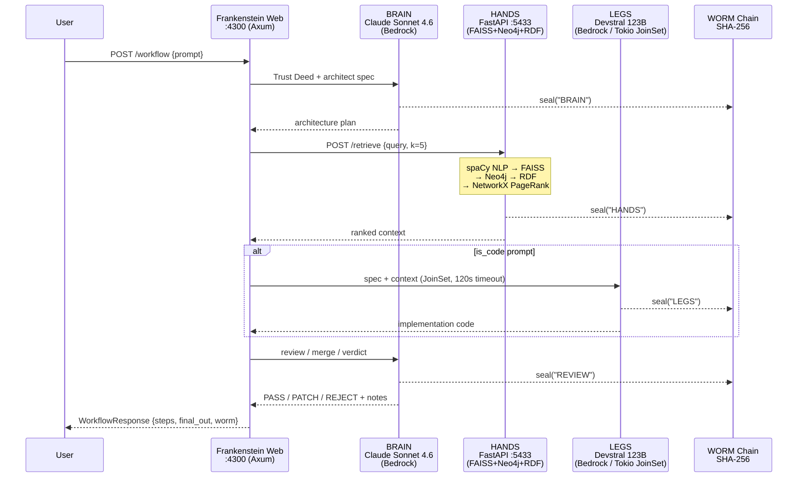

```
╔══════════════════════════════════════════════════════════════════════════════╗
║                                                                              ║
║    ⬡  F R A N K E N S T E I N                                               ║
║                                                                              ║
║    ░░░░░░░░░░░░░░░░░░░░░░░░░░░░░░░░░░░░░░░░░░░░░                            ║
║    🧠 BRAIN  · 🤲 HANDS  · 🦵 LEGS  · Ω SEALED                             ║
║    Rust Tokio  · AWS Bedrock · pgvector · vLLM                              ║
║    ░░░░░░░░░░░░░░░░░░░░░░░░░░░░░░░░░░░░░░░░░░░░░                            ║
║                                                                              ║
║    ⬡ Ω ↺ Ψ Δ Λ Σ Φ α  — powered by BOB                                    ║
║                                                                              ║
╚══════════════════════════════════════════════════════════════════════════════╝
```

sovereign-35 (FRANKENSTEIN) is a Rust Tokio web server implementing a three-stage sovereign AI workflow engine: a **Brain** (Claude Sonnet 4.6 via AWS Bedrock) that architects plans and injects Trust Deed governance, **Hands** (a Python FastAPI sidecar on port 5433 running FAISS + Neo4j + RDF + NetworkX + spaCy for corpus retrieval), and **Legs** (Devstral 123B via Bedrock, spawned in a Tokio `JoinSet` with a 120-second timeout, that executes the Brain's specification into working code). Every step is sealed with a running SHA-256 WORM chain. The server also exposes a **CODE BATTLE** mode that fires Claude Sonnet 4.6, Claude Opus 4.6, and Devstral 123B concurrently on the same prompt and returns all three answers side-by-side, plus an **ASK** mode for sovereign queries without the code path. The dark-terminal HTML UI renders at `http://localhost:4300`. Two binaries are compiled from the same codebase: `sovereign` (CLI REPL) and `frankenstein` (web server).

## Architecture



## File Tree

```
sovereign-35/
├── src/
│   ├── main.rs                 # `sovereign` binary — CLI REPL (Tokio async, Lean4+Prolog+Tavily+DDG)
│   ├── web.rs                  # `frankenstein` binary — Axum web server + HTML UI
│   ├── inject/
│   │   └── trust_deed.rs       # Trust Deed v1.0 system prompt (7 articles) + EmojiScript layer
│   ├── models/
│   │   ├── bedrock.rs          # AWS Bedrock invocation (Claude + Devstral)
│   │   └── vllm.rs             # vLLM HTTP client (local Granite / Qwen)
│   ├── tools/
│   │   ├── tavily.rs           # Tavily search API
│   │   └── ddg.rs              # DuckDuckGo fallback search
│   └── gates/
│       ├── lean4.rs            # Lean 4 formal gate (Pass/Warn/Reject verdict)
│       └── prolog.rs           # Prolog constraint engine
├── hands/
│   ├── hands_server.py         # FastAPI sidecar: FAISS+Neo4j+RDF+NetworkX+spaCy+NLTK
│   └── requirements.txt        # Python dependencies
├── Cargo.toml                  # Two binaries: sovereign + frankenstein
└── .env                        # TAVILY_API_KEY, NEO4J_URI, etc.
```

## Quick Start

**Prerequisites:** Rust 1.78+, AWS credentials configured (`~/.aws/credentials`, region `us-east-1`), Python 3.10+ (for Hands sidecar)

```bash
# Clone
git clone <repo>
cd sovereign-35

# Configure
cp .env.example .env   # add TAVILY_API_KEY if you have one

# Build both binaries
cargo build --release

# ── Run FRANKENSTEIN web server (recommended) ──────────────────
cargo run --release --bin frankenstein
# → http://localhost:4300

# ── Or run the CLI REPL ───────────────────────────────────────
cargo run --release --bin sovereign

# ── Optional: start the HANDS sidecar for corpus retrieval ────
cd hands
pip install -r requirements.txt
python hands_server.py
# → http://localhost:5433
# Without hands: Frankenstein degrades gracefully (HANDS_OFFLINE)
```

**Models used (all via AWS Bedrock — no direct API keys):**

| Role | Model ID |
|---|---|
| Brain (architect + review) | `us.anthropic.claude-sonnet-4-6` |
| Battle: Opus | `us.anthropic.claude-opus-4-6-v1` |
| Legs / Battle: Code | `mistral.devstral-2-123b` |
| CLI code path | `Qwen/Qwen2.5-Coder-7B-Instruct` (vLLM) |

**Web API endpoints:**

| Method | Path | Description |
|---|---|---|
| GET | `/` | Dark terminal HTML UI |
| POST | `/workflow` | Full Brain→Hands→Legs→Review pipeline |
| POST | `/battle` | 3-way concurrent model comparison |
| POST | `/ask` | Sovereign query (Brain + Tavily, no code path) |
| GET | `/worm` | Current WORM chain hash + seal count |

## Key Features

- **BRAIN → HANDS → LEGS pipeline** — Claude Sonnet 4.6 architects, pgvector corpus retrieves context, Devstral 123B implements code; all stages independently WORM-sealed
- **Tokio JoinSet Legs execution** — Legs runs as an independent async task with a configurable timeout (120s); Brain never blocks waiting for Legs; graceful `LEGS_TIMEOUT` on miss
- **CODE BATTLE mode** — fires Frankenstein (Sonnet 4.6 + Trust Deed), raw Claude Opus 4.6, and Devstral 123B concurrently via `tokio::join!`; three-column terminal UI
- **Trust Deed injection** — seven-article sovereign constitution baked into every Brain system prompt (Identity, Truth Mandate, Search Protocol, Formal Gate, Code Protocol, EmojiScript, No Institutional Capture)
- **HANDS retrieval sidecar** — five-layer knowledge pipeline: spaCy NLP parse → FAISS vector search → Neo4j graph traversal → RDF triple extraction → NetworkX PageRank re-ranking; each layer degrades gracefully if its backend is offline
- **Lean 4 + Prolog gates** — formal verification and constraint satisfaction run concurrently with search on every CLI query
- **Tavily + DuckDuckGo search** — primary and fallback web search fired concurrently via `tokio::join!`
- **SHA-256 WORM chain** — genesis block `FRANKENSTEIN_GENESIS`, every pipeline step appended; hash and seal count returned in every API response
- **Dark terminal HTML UI** — green-on-black monospace, three-panel tabbed interface (Workflow / Battle / Ask), live WORM bar, four-column pipeline step display, no framework dependencies

---

*Apache 2.0 · SnapKitty Collective 2026 · Evidence or Silence*
